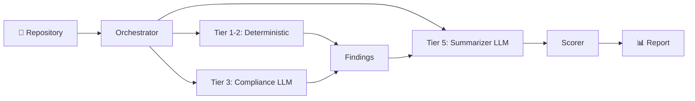
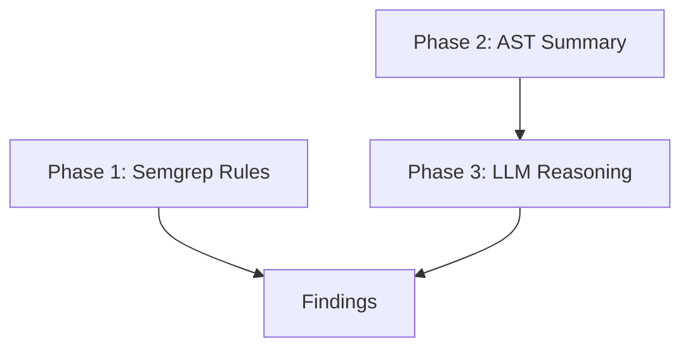

# VibeAudit — Architecture & Scoring Deep Dive

## The Pipeline



**Key design principle:** 95% deterministic, 5% LLM. Most analysis uses zero API calls.

---

## The 7 Analyzers

| Tier | Analyzer | What It Detects | How (Tools) |
|------|----------|-----------------|-------------|
| 1 | **Secrets** | Hardcoded API keys, passwords, tokens | `detect-secrets` + post-processing filters |
| 1 | **Dependencies** | Hallucinated packages (don't exist on NPM/PyPI), known CVEs | HTTP 404 checks + `pip-audit` |
| 1 | **Hallucination** | Fake imports (`from react import FakeHook`) | Known-exports map for 20+ packages |
| 1 | **Cost Efficiency** | Expensive LLM models, over-provisioned infra, bloated deps | Regex pattern matching |
| 2 | **SAST** | SQL injection, XSS, insecure crypto, vibe antipatterns | [bandit](file:///home/ved/Desktop/HackX-4.0-UdhaarFC-PS1/vibe_check/analyzers/sast.py#44-135) + [semgrep](file:///home/ved/Desktop/HackX-4.0-UdhaarFC-PS1/vibe_check/analyzers/prompt_injection.py#86-131) with custom rules |
| 2 | **Prompt Injection** | Unsanitized LLM output, template injection | Custom semgrep rules |
| 3 | **Compliance** | GDPR/SOC2 gaps — missing consent, unencrypted PII, no audit logs | Semgrep rules + Gemini 2.5 Pro reasoning |
| 5 | **LLM Summarizer** | Executive summary + copy-paste remediation prompts | Gemini 2.5 Pro (1 call) |

### Tier System
- **Tier 1 (Fast):** Pure file scanning, regex, HTTP checks. Runs in <5s.
- **Tier 2:** External tools (bandit, semgrep). Runs in <15s.
- **Tier 3:** LLM-assisted analysis. One API call with compressed AST summary.
- **Tier 5:** Post-processing. Runs after all other analyzers finish.

**Fast mode** (`--mode fast`) = Tier 1 only. Zero external tool calls, zero LLM cost.

---

## Vibe-to-Value Score

### Formula

```
Category Score = 100 − Σ(penalty × confidence)
```

Each finding deducts from its category based on severity:

| Severity | Penalty | Example |
|----------|---------|---------|
| CRITICAL | −30 | Hardcoded AWS secret key |
| HIGH | −15 | SQL injection, missing auth on PII route |
| MEDIUM | −7 | HTTP URL to external host, bloated dependency |
| LOW | −3 | Missing rate limiting, verbose logging |
| INFO | 0 | Executive summary, remediation prompts |

### Diminishing Returns

Prevents one noisy category from going to zero:

| Finding # | Penalty Multiplier |
|-----------|-------------------|
| 1–3 | **100%** (full weight) |
| 4–5 | **50%** |
| 6+ | **25%** |

**Example:** 8 medium findings at 0.7 confidence:
- Findings 1-3: 3 × 7 × 0.7 = **−14.7**
- Findings 4-5: 2 × 3.5 × 0.7 = **−4.9**
- Findings 6-8: 3 × 1.75 × 0.7 = **−3.7**
- **Category Score: 100 − 23.3 = 76.7** (instead of 60.8 without diminishing returns)

### Composite Score

Weighted average across active categories:

| Category | Weight |
|----------|--------|
| Secrets | 20% |
| Dependencies | 20% |
| SAST | 15% |
| Compliance (GDPR + SOC2) | 15% |
| Prompt Injection | 10% |
| Cost Efficiency | 10% |
| Code Quality | 5% |
| IaC Security | 2.5% |
| LLM Review | 2.5% |

> Only categories with findings are included. Unused analyzers don't inflate or deflate the score.

### Grade & Verdict

| Score | Grade | Verdict |
|-------|-------|---------|
| 97+ | A+ | PRODUCTION READY |
| 80–96 | B range | PRODUCTION READY |
| 60–79 | C/D range | NEEDS REMEDIATION |
| 40–59 | D/F | NOT PRODUCTION READY |
| <40 | F | CRITICAL — DO NOT DEPLOY |

---

## Compliance Deep Dive (3-Phase)



1. **Phase 1** — [gdpr.yml](file:///home/ved/Desktop/HackX-4.0-UdhaarFC-PS1/vibe_check/rules/gdpr.yml) + [soc2.yml](file:///home/ved/Desktop/HackX-4.0-UdhaarFC-PS1/vibe_audit/rules/soc2.yml) semgrep rules (deterministic)
2. **Phase 2** — Builds compressed structural summary:
   - Routes with protection status (protected vs unprotected)
   - PII fields with file locations
   - Auth decorators, logging patterns
   - Consent mechanism, deletion endpoint, encryption detection
3. **Phase 3** — Sends summary to Gemini 2.5 Pro with evidence-grounding prompt
   - Must cite specific files from evidence
   - Capped at 5 findings
   - References GDPR articles (Art. 6, 17, 25) and SOC2 controls (CC6.1, CC7.2)

---

## Output Formats

| Format | Use Case |
|--------|----------|
| `--format terminal` | Rich CLI output with color bars |
| `--format json` | Programmatic consumption (VS Code extension, CI pipelines) |
| `--format markdown` | GitHub PR comments via Actions |

---

## CI/CD Integration

```yaml
# .github/workflows/vibecheck.yml
- run: pip install vibe-check-cli
- run: vibe-check scan . --format markdown > report.md
- uses: actions/github-script@v7  # Posts as PR comment
- run: vibe-check score . --exit-code --threshold 60  # Gate
```

**Gating:** `--exit-code --threshold 60` fails the pipeline if score drops below 60.

---

## Key Differentiators (Pitch Points)

1. **95% deterministic** — Most tools are LLM-first. We're regex-first, LLM-last.
2. **Token budget enforcement** — Hard cap on LLM usage per scan. Predictable cost.
3. **Hallucination detection** — No other tool checks if AI-generated `import` statements reference real APIs.
4. **Cost efficiency analysis** — Flags expensive model choices and over-provisioned infra.
5. **One-command CI/CD** — `pip install vibe-check-cli && vibe-check scan .` in any GitHub Action.
6. **Auto-remediation prompts** — Copy-paste into Cursor/Copilot to fix findings instantly.
